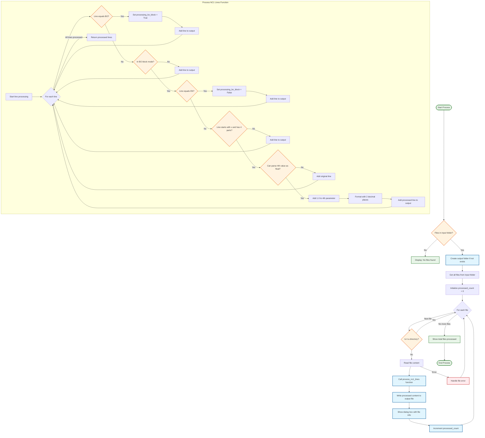

# NC1 File Processor - Bolt Slot Adjustment Tool

## Overview

T5. **Locates folders**: Uses absolute paths relative to script location
6. **Scans input folder**: Finds all files in the script's `input/` directory
7. **Creates output folder**: Automatically creates `output/` if it doesn't exist
8. **Processes each file**: Applies the BO block processing to each file with console logging
9. **Handles errors**: Reports errors via dialogs without stopping the entire batch
10. **Shows final summary**: Displays completion dialog with results and output locationol processes NC1 (Numerical Control) files to automatically adjust bolt slot cutting plans. It searches for specific "BO" (Bolt Operation) blocks in the files and adjusts V parameter values by a user-specified amount, which is commonly used in CNC machining to adjust cutting depths or positions.

## Features

- **Interactive User Input**: Prompts user for adjustment amount with validation
- **Batch Processing**: Processes all files in the `input/` folder automatically
- **Multiple BO Block Support**: Handles multiple BO sections within each file
- **Flexible Adjustments**: Supports positive and negative value adjustments
- **Streamlined Processing**: Efficient batch processing with summary feedback
- **Error Handling**: Continues processing even if individual files fail
- **Portable**: Works when run from VS Code, File Explorer, or command line
- **Automatic Output**: Saves processed files to the `output/` folderocessor - Bolt Slot Adjustment Tool

## Overview

This tool processes NC (Numerical Control) files to automatically adjust bolt slot cutting plans. It searches for specific "BO" (Bolt Operation) blocks in the files and increments certain V parameter values by 1.0, which is commonly used in CNC machining to adjust cutting depths or positions.

## Features

- **Batch Processing**: Processes all files in the `input/` folder automatically
- **Selective Processing**: Only modifies specific V parameters within BO blocks
- **Visual Feedback**: Shows dialog boxes for each processed file
- **Error Handling**: Continues processing even if individual files fail
- **Automatic Output**: Saves processed files to the `output/` folder

## File Structure

```
bdt-adjust-cutting plan/
├── adjust-bolt-slot.py    # Main processing script
├── README.md             # This documentation
├── input/                # Place your NC1 files here
└── output/               # Processed files will be saved here
```

## How It Works

### 1. File Processing Logic

The `process_nc1_lines()` function performs the following steps:

1. **Searches for BO blocks**: Looks for lines containing "BO" (Bolt Operation)
2. **Processes V parameters**: Within BO blocks, finds lines with format: `v x y z value`
3. **Adjusts values**: Adds user-specified amount to the fourth parameter (z-axis depth adjustment)
4. **Handles multiple BO blocks**: Continues processing after "EN" markers to find additional BO blocks
5. **Preserves formatting**: Maintains original spacing and structure

### 2. User Interaction

The script provides interactive dialogs for:

1. **Input prompt**: User enters adjustment amount with examples and validation
2. **Confirmation dialog**: Shows the entered value and asks for confirmation
3. **Error notifications**: Individual error dialogs if files fail to process
4. **Final summary**: Completion status with total files processed and output location

### 3. Batch Processing

### 3. Batch Processing

The `process_all_files()` function:

1. **Gets user input**: Prompts for adjustment amount with validation
2. **Confirms settings**: Shows confirmation dialog before processing
3. **Locates folders**: Uses absolute paths relative to script location
4. **Scans input folder**: Finds all files in the script's `input/` directory
5. **Creates output folder**: Automatically creates `output/` if it doesn't exist
6. **Processes each file**: Applies the BO block processing to each file
7. **Shows progress**: Displays dialog boxes with processing information
8. **Handles errors**: Reports errors without stopping the entire batch

## Code Flow Diagram

The following Mermaid flowchart illustrates the complete process flow of the NC1 file processor:



### Diagram Legend

- **🟢 Green**: Start/End points and summary messages
- **🟠 Orange**: Decision points and conditional logic
- **🔵 Blue**: Processing steps and operations
- **🔴 Red**: Error handling

## Usage Instructions

### Prerequisites

- Python 3.x installed
- tkinter library (usually included with Python)

### Step-by-Step Usage

1. **Place your files**: Put all NC1 files to be processed in the `input/` folder (in the same directory as the script)

2. **Run the script**: Execute the script by either:
   - **Double-clicking** `adjust-bolt-slot.py` in File Explorer
   - **Running in VS Code**: Press F5 or use the Run button
   - **Command line**: `python adjust-bolt-slot.py`

3. **Enter adjustment value**: When prompted, enter the adjustment amount:
   - Positive values (e.g., `1.0`, `2.5`) to increase parameters
   - Negative values (e.g., `-0.5`, `-1.0`) to decrease parameters
   - Range: -100.0 to +100.0

4. **Confirm settings**: Review and confirm the adjustment amount

5. **Processing**: The script will process all files automatically with console output showing progress

6. **Check results**: When complete, a summary dialog will show:
   - Total files processed
   - Applied adjustment value
   - Output folder location
   
   Processed files will be saved in the `output/` folder with the same filenames

### Example Input/Output

**Input file example** (`input/part001.nc1`):
```
G01 X10 Y20
BO
  v      40.00s     40.00      26.00
  v      40.00s    310.00      26.00
EN
AK
  v       0.00u      0.00       0.00
BO
  v     310.00s     40.00      26.00
  v     310.00s    310.00      26.00
EN
G01 X30 Y40
```

**User Input**: `1.5` (increase by 1.5)

**Output file example** (`output/part001.nc1`):
```
G01 X10 Y20
BO
  v      40.00s     40.00      27.50
  v      40.00s    310.00      27.50
EN
AK
  v       0.00u      0.00       0.00
BO
  v     310.00s     40.00      27.50
  v     310.00s    310.00      27.50
EN
G01 X30 Y40
```

**Result**: All 26.00 values in BO blocks are increased to 27.50. Notice how both BO blocks are processed and non-BO sections remain unchanged.

## Code Structure

### Main Functions

#### `get_adjustment_number()`
- **Purpose**: Prompts user for adjustment value with validation
- **Features**:
  - Interactive dialog with examples
  - Input validation (-100.0 to +100.0 range)
  - Default value of 1.0
  - Cancellation handling

#### `process_nc1_lines(lines, adjust_number)`
- **Purpose**: Processes individual file lines to adjust V parameters in BO blocks
- **Input**: List of file lines and user-specified adjustment amount
- **Output**: List of processed lines with adjusted values
- **Logic**: 
  - Tracks BO block state
  - Identifies V parameter lines
  - Applies user-specified adjustment to fourth parameter
  - Maintains original formatting

#### `process_all_files()`
- **Purpose**: Batch processes all files in input folder with streamlined user interaction
- **Features**:
  - User input prompts and confirmation
  - Absolute path handling for portability
  - File discovery using glob patterns
  - Error handling for individual files
  - Console logging for processing progress
  - Final summary dialog with results
  - Automatic output folder creation

### Key Processing Rules

1. **BO Block Detection**: Only processes lines between "BO" and "EN" markers
2. **V Parameter Format**: Only modifies lines with exactly 4 space-separated values starting with "v"
3. **User-Defined Adjustment**: Adds user-specified amount to the fourth parameter
4. **Multiple BO Support**: Processes all BO blocks found in each file
5. **Precision**: Maintains 2 decimal places in output values
6. **Error Tolerance**: Skips invalid lines without stopping processing
7. **Path Independence**: Works regardless of where the script is run from

## Error Handling

The script includes comprehensive error handling:

- **User Input Validation**: Ensures adjustment values are within acceptable range
- **File System Errors**: Clear messages when input folder is missing or inaccessible
- **File Reading Errors**: Reports files that cannot be opened with specific error details
- **Value Parsing Errors**: Skips lines with invalid numeric values without stopping
- **Processing Errors**: Continues batch processing even if individual files fail
- **Encoding Issues**: Uses UTF-8 encoding to handle various text formats
- **Path Resolution**: Automatically handles different execution contexts (VS Code, File Explorer, command line)

## Customization Options

### Modifying the Default Adjustment Value

To change the default value shown in the input dialog, modify the `initialvalue` parameter in the `get_adjustment_number()` function:

```python
adjust_number = simpledialog.askfloat(
    "Adjustment Value",
    # ... dialog text ...
    initialvalue=2.0,  # Change from 1.0 to your preferred default
    minvalue=-100.0,
    maxvalue=100.0
)
```

### Changing Input/Output Validation Range

To modify the acceptable range for adjustment values, change the `minvalue` and `maxvalue` parameters:

```python
initialvalue=1.0,
minvalue=-50.0,   # Change minimum allowed value
maxvalue=50.0     # Change maximum allowed value
```

### Changing Target Parameters

To modify different V parameters, change the index in the `process_nc1_lines()` function:

```python
old_value = float(parts[2])  # Third parameter instead of fourth
parts[2] = f"{old_value + adjust_number:.2f}"
```

### Disabling Individual File Dialog Boxes

The current version processes files efficiently without showing a dialog for each file. If you want to add individual file dialogs back, you can add this code after the file processing section:

```python
# Add this after writing the output file to show progress for each file
root = tk.Tk()
root.withdraw()
messagebox.showinfo(
    "File Processed", 
    f"Successfully processed file:\n\n"
    f"Input: {filename}\n"
    f"Output: {os.path.basename(output_path)}\n"
    f"Adjustment applied: {adjust_number:+.2f}\n"
    f"Files processed: {processed_count}"
)
root.destroy()
```

### Changing Decimal Precision

To change the number of decimal places in output values, modify the format string:

```python
parts[3] = f"{old_value + adjust_number:.3f}"  # 3 decimal places instead of 2
```

## Troubleshooting

### Common Issues

1. **Script doesn't run when double-clicked**:
   - Ensure Python is installed and associated with `.py` files
   - Try right-clicking the script and selecting "Open with" → "Python"

2. **"Input folder not found" error**:
   - Create an `input` folder in the same directory as the script
   - Ensure the folder name is exactly `input` (lowercase)

3. **No files found**:
   - Verify NC1 files are placed in the `input/` folder
   - Check that files have the correct extension and aren't in subfolders

4. **Dialog boxes not appearing**:
   - Ensure tkinter is properly installed (usually comes with Python)
   - Try running from command line to see error messages

5. **Permission errors**:
   - Check that you have write access to the script directory
   - Run as administrator if necessary (Windows)

6. **Encoding errors**:
   - Try saving input files with UTF-8 encoding
   - Check for special characters in file content

7. **Values not changing as expected**:
   - Verify your NC1 files have the correct BO block format
   - Check that V parameter lines have exactly 4 space-separated values starting with "v" (lowercase)
   - Ensure the fourth parameter is a valid number

8. **Processing seems to hang**:
   - Check console output for progress messages
   - Large files or many files may take time to process
   - Error dialogs may be waiting for user interaction

### Debugging Tips

- **Console output**: Check the console/terminal for detailed processing progress and error messages
- **Test with one file**: Try processing a single file first to isolate issues
- **Verify file format**: Ensure BO blocks are properly formatted with EN endings
- **Check file paths**: Verify the script can find input/output directories
- **Validate adjustment range**: Ensure adjustment values are within -100.0 to +100.0
- **Monitor processing**: Watch console output to see which files are being processed

### Getting Help

- Review error dialog messages for specific file issues
- Check console output for detailed processing information
- Verify input file format matches the expected NC1 structure
- Test with the provided example files first

## License

This tool is provided as-is for CNC machining workflow automation. Modify and use according to your needs.

## Support

For issues or modifications, review the code comments and error messages. The script is designed to be self-documenting and includes detailed error reporting.
